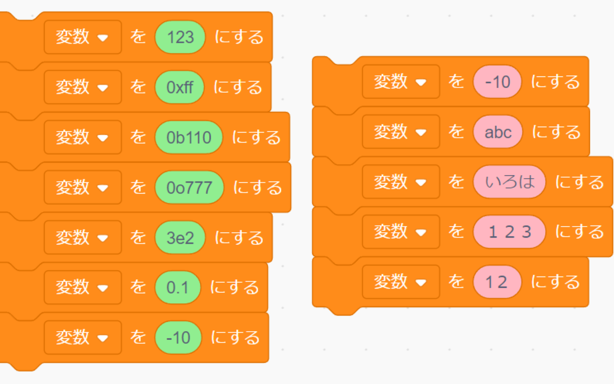

# ScratchHighlighter
color the input fields in Scratch

このChrome拡張は、Scratchの入力欄に色をつけて、数字と文字を判別しやすくします。

[midorigoke/ScratchHighlightFullwidthNumber][def] にインスパイアされて作られました。

[def]: https://github.com/midorigoke/ScratchHighlightFullwidthNumber
